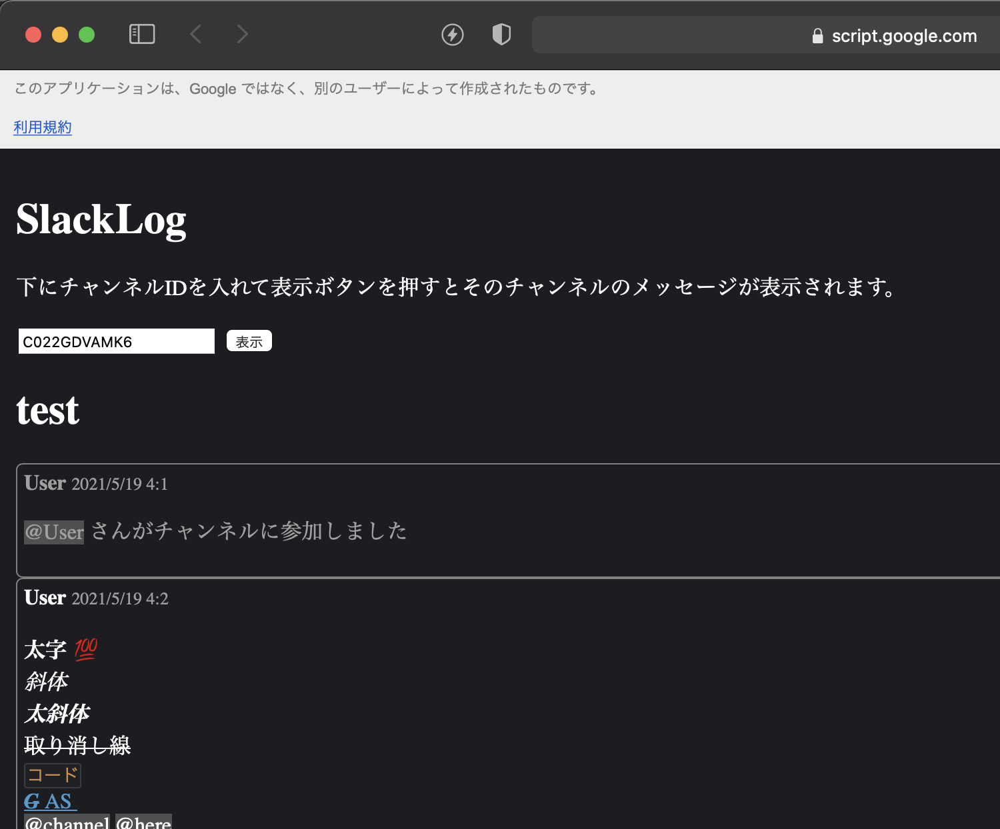

# SlackLogGAS

サークルで使用していた無料版のSlackで1万件を超えるメッセージも閲覧できるようにするため、送信されたメッセージとファイルを一定期間ごとにGoogleドライブに保存して、ブラウザで閲覧できるようなプログラムを作りました。

## 導入方法
### 1. Slackアプリを作る
Slackのアプリを作って、Scopesの**User** Token Scopesの方に以下の9つを追加します。アプリの作り方は[こちら](https://www.whizz-tech.co.jp/5857/)が分かりやすかったです。
- channels:history
- channels:read
- chat:write
- emoji:read
- files:read
- files:write
- groups:history
- groups:read
- users:read

インストール後に表示される「User Auth Access Token」(xoxp-……)をどこかにメモしておきます。

### 2. GoogleAppsScript (GAS) でデータを保存する
まずGoogleドライブに「SlackLog」という名前のフォルダを作り、このフォルダIDをメモしておきます。

次に「gasCode」内のファイルをGASにコピペします。([clasp](https://github.com/google/clasp)を使える方は「code」内のファイルをclasp pushすれば大丈夫です。)

「1_main.gs」の頭の2行に上でメモしておいたtokenとフォルダIDを書いて、「initialSetting」関数を実行します。これで自動でメッセージとファイルを保存してくれるようになります。

### 3. 保存したログを見られるようにする
GASのエディタで「デプロイ」→「新しいデプロイ」を選択し、「ウェブアプリ」を選択します。実行するユーザを自分にし、アクセスできるユーザを好きに設定して「デプロイ」を押すとウェブアプリのURLが表示されます。

このURLにアクセスして、SlackのチャンネルIDを入力して「表示」ボタンを押すと保存したログを見ることができます。

## 注意点
- メッセージが保存されるチャンネルは全てのパブリックチャンネルと、アプリを作った人が参加しているプライベートチャンネルのみです。それ以外のプライベートチャンネルやDMは保存されません。
- Googleドライブの容量が足りない時の動作は未確認です。
- Slackのメッセージ中のblockを利用しているので、blockが存在しない頃の古いメッセージは上手く表示できません。
- その他、素人の書いたプログラムのためバグや機能不十分な箇所があると思います。万が一使用される場合は自己責任でお願い致します🙇‍♂️